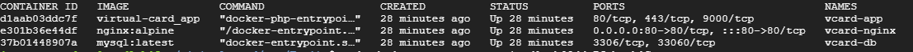

# Project Virtual Card

**Note**: *This project was builted based on Ubuntu 22.04. Please notice that the instructions provided assume you are using Ubuntu 22.04. If you are using a different operating system or version, make sure to adapt the commands accordingly to your environment.*

## API Access
The project includes a RESTful API that can be accessed using tools like Postman. You can send HTTP requests to the API endpoints to interact with the application.


## Instructions to Run the Project

 - **Clone the project and access his folder:**
```sh
git clone https://github.com/jamessoncardozo/virtual-card.git

cd virtual-card/
```

- **Edit the docker-compose.yml file**

```sh
sudo nano docker-compose.yml
```

- **Make the following changes in the docker-compose.yml file:**
- Under the services section, locate the app service and modify the args section as follows:

```sh
services:
  app:
    build:
      args:
        user: your_SO_user_name
        Country: your_country(US/BR/AU/UK/AR)
        State: your_province_name
        Locality: your_city_name
        Organization: your_company_name
        OrganizationalUnit: your_dept_name
        CommonName: ${HOSTNAME} # coming from your .env file
        EmailAddress: youradress@example.com
```

- **Save the changes to the docker-compose.yml file.**

- **Create and edit the .env file:**

```sh
sudo cp .env.example .env
sudo nano .env
```

- **Update the following environment variables in the .env file:**

```sh
APP_ENV=production #You can change to local or testing mode.
APP_DEBUG=false
APP_HOSTNAME=your_host_name # Your machine name
# This is important to your mobile scanning and redirect to user page
APP_URL=http://localhost # To testing environment, ALWAYS KEEP AS LOCALHOST. 

# DB Configuration

DB_DATABASE=your_database_name
DB_USERNAME=your_database_user
DB_PASSWORD=your_laravel_db_password
```

- **Build the Docker containers:**

```sh
sudo docker-compose build --force-rm --pull --no-cache
```

- **Start the project containers:**

```sh
sudo docker-compose up -d --build
sudo docker ps
```
As you can see, all containers are up! Now get the *virtual-card_app* ID.


- **Access the container:**

With the Container ID from virtual-card_app image you will be able to access your app container as root.
```sh
sudo docker exec -u root -it d1aab03ddc7f bash
```
## Now let's put this application into production!
- First of all, install the project dependencies.

```sh
composer install
```
- For some reason, your privileges may need to be to upgraded.

```sh
chown -R www-data:www-data ./*
chmod -R 3775 ./*
```

### **Database Migration**
- Run the following command to migrate the database:
```sh
php artisan migrate
```

- Generate Laravel application key:
```sh
php artisan key:generate
```

### **Clear Configuration Cache**
If you make changes to the configuration files, clear the configuration cache using the following command:

```sh
php artisan config:cache
php artisan cache:clear
php artisan view:clear
php artisan config:clear
```
## That's it! You have successfully set up and run the Virtual Card project. Feel free to explore. 

### Running Tests

You can run the following tests to verify the functionality of the API. These tests are located in the `tests/Feature/Livewire/Api` directory:

- Add One User:
```sh
sudo php artisan test --filter ApiCreateUserTest::the_api_can_add_one_user
```

- Delete One User:
```sh
sudo php artisan test --filter ApiDelUserTest::the_api_can_del_one_user
```

-Get All Users:
```sh
sudo php artisan test --filter ApiGetAllUsersTest::the_api_return_all_users
```

-Get One Users:
```sh
sudo php artisan test --filter ApiGetUserTest::the_api_return_one_user
```

- Update One User:

```sh
sudo php artisan test --filter ApiUpdateUserTest::the_api_can_put_one_user
```

## **Author**

Jamesson Cardozo

### - Follow me

- [Twitter](https://twitter.com/jamessoncardozo)
- [LinkedIn](https://www.linkedin.com/in/jamessoncardozo)
- [Instagram](https://www.instagram.com/jamessoncardozo)
- [Github](https://www.github.com/jamessoncardozo)